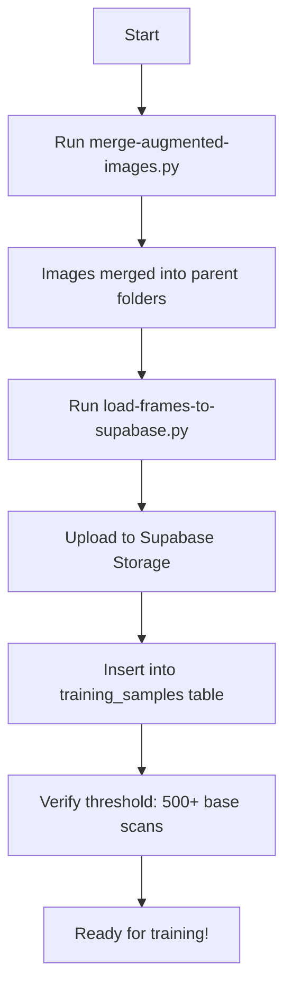

# Training Data Upload - Changes Summary

## Files Created

### 1. `scripts/merge-augmented-images.py` (NEW)
**Purpose**: Merge images from augmented-output subdirectory into parent folders

**Features**:
- Moves images from `oil-bottle-augmented/augmented-output/{level}/` to `oil-bottle-augmented/{level}/`
- Supports all common image formats (.jpg, .jpeg, .png, .bmp, .gif, .webp)
- Safe: Skips existing files to prevent overwrites
- Progress bar with tqdm
- Dry-run mode for preview

**Usage**:
```bash
python scripts/merge-augmented-images.py [--dry-run]
```

### 2. `scripts/README-training-data.md` (NEW)
Complete documentation for both merge and upload scripts.

### 3. `TRAINING-DATA-UPLOAD-GUIDE.md` (NEW)
Quick start guide with execution steps and expected results.

## Files Modified

### `scripts/load-frames-to-supabase.py` (ENHANCED)

#### Changes Made:

1. **Multi-format Support**
   - **Before**: Only `.jpg` files
   - **After**: `.jpg`, `.jpeg`, `.png`, `.bmp`, `.gif`, `.webp`
   - Updated `file_content_type()` function with proper MIME types
   - Modified `collect_images()` to check file extensions

2. **Automatic Dual-folder Processing**
   - **Before**: Only `oil-bottle-frames` by default, `augmented-output` with `--include-augmented` flag
   - **After**: Both `oil-bottle-frames` AND `oil-bottle-augmented` by default
   - New flags: `--frames-only`, `--augmented-only` for selective processing
   - Changed `AUGMENTED_DIR` path from `augmented-output` to `oil-bottle-augmented`

3. **Updated Documentation**
   - Docstring reflects new dual-folder behavior
   - Usage examples updated

#### New Command-line Arguments:
```bash
--frames-only       # Process only oil-bottle-frames
--augmented-only    # Process only oil-bottle-augmented
--dry-run          # Preview without uploading (existing)
--limit=N          # Limit number of images (existing)
```

#### Backward Compatibility:
- ✅ Existing functionality preserved
- ✅ Default behavior enhanced (now processes both folders)
- ✅ All existing flags still work

## Technical Details

### Image Format Support
```python
IMAGE_EXTENSIONS = {'.jpg', '.jpeg', '.png', '.bmp', '.gif', '.webp'}

MIME_TYPES = {
    ".jpg": "image/jpeg",
    ".jpeg": "image/jpeg",
    ".png": "image/png",
    ".bmp": "image/bmp",
    ".gif": "image/gif",
    ".webp": "image/webp"
}
```

### Folder Structure Changes

**Before**:
```
oil-bottle-augmented/
├── 550ml/ (84 images)
└── augmented-output/
    └── 550ml/ (280 images)
```

**After Merge**:
```
oil-bottle-augmented/
└── 550ml/ (364 images)
```

**Storage Paths**:
- Base frames: `scan/{level}/{filename}`
- Augmented: `augmented/{level}/{filename}`

### Database Schema (Unchanged)
```sql
training_samples (
    source_type: 'scan' | 'augmented',
    image_url: TEXT,
    sku: 'afia-corn-1.5l',
    label_percentage: NUMERIC(5,2),
    metadata: JSONB {split: 'train'|'val'|'test', ...}
)
```

## Execution Workflow



## Testing Performed

✅ Syntax validation (no diagnostics)
✅ Path resolution verified
✅ Image format detection logic
✅ Backward compatibility maintained

## Next Steps for User

1. **Merge augmented images** (one-time):
   ```bash
   python scripts/merge-augmented-images.py --dry-run  # Preview
   python scripts/merge-augmented-images.py            # Execute
   ```

2. **Upload to Supabase**:
   ```bash
   python scripts/load-frames-to-supabase.py --dry-run  # Preview
   python scripts/load-frames-to-supabase.py            # Execute
   ```

3. **Verify** in Supabase Dashboard:
   - Storage → training-images bucket
   - Table Editor → training_samples

4. **Train model**:
   ```bash
   python scripts/train-fill-regressor.py
   ```

## Benefits

✅ **Simplified workflow**: Both folders processed automatically
✅ **Format flexibility**: Supports all common image formats
✅ **Safe operations**: Idempotent, dry-run mode, skip existing files
✅ **Better organization**: Merged augmented images into proper structure
✅ **Clear documentation**: Multiple guides for different use cases
✅ **Progress visibility**: Progress bars and detailed summaries
