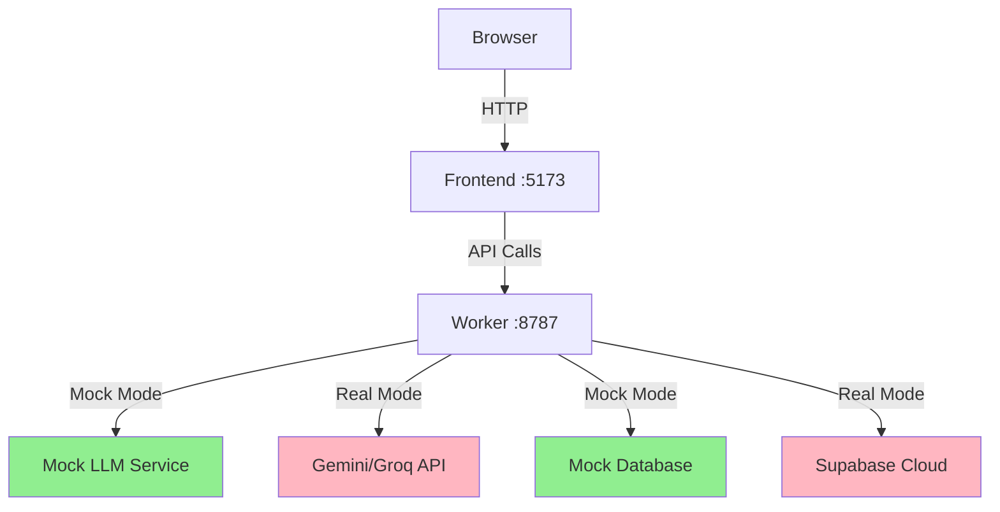

# Local Development Guide

## Table of Contents

- [Overview](#overview)
- [Prerequisites](#prerequisites)
- [Quick Start](#quick-start)
- [Environment Configuration](#environment-configuration)
- [Development Workflow](#development-workflow)
- [Testing](#testing)
- [Troubleshooting](#troubleshooting)
- [Architecture Overview](#architecture-overview)

## Overview

This guide helps you set up and run the Afia Oil Tracker locally for development. You can work entirely offline using mock services—no API keys or cloud services required.

**What you'll accomplish:**

- Install and configure the development environment
- Run the application locally with mock services
- Execute tests without external dependencies
- Understand the local development workflow

## Prerequisites

Before you begin, ensure you have:

- **Node.js** 18.x or higher
- **npm** 9.x or higher
- **Git** for version control
- **Bash shell** (Git Bash on Windows, native on macOS/Linux)

## Quick Start

Get up and running in three steps:

### 1. Install Dependencies

```bash
# Install frontend dependencies
npm install

# Install worker dependencies
cd worker && npm install && cd ..
```

### 2. Configure Environment

Copy the example configuration files:

```bash
cp .env.example .env.local
cp worker/.dev.vars.example worker/.dev.vars
```

**Enable mock mode** to work without API keys:

```bash
# Edit worker/.dev.vars
ENABLE_MOCK_LLM="true"
```

### 3. Start Development Servers

**Option A: Unified Script (Recommended)**

```bash
./start-local-dev.sh
```

**Option B: Manual Start**

```bash
# Terminal 1 - Start Worker
cd worker && wrangler dev

# Terminal 2 - Start Frontend
npm run dev
```

### 4. Verify Setup

Open your browser and check:

- **Frontend:** [http://localhost:5173](http://localhost:5173)
- **Worker API:** [http://localhost:8787](http://localhost:8787)
- **Health Check:** [http://localhost:8787/health](http://localhost:8787/health)

You should see the application running with mock data.

## Environment Configuration

### Frontend Configuration

The frontend uses `.env.local` for configuration:

```env
# API endpoint (points to local Worker)
VITE_PROXY_URL="http://localhost:8787"

# Feature flags
VITE_ENABLE_ANALYTICS="false"
```

### Worker Configuration

The Worker uses `worker/.dev.vars` for configuration:

```env
# Mock Mode (no API keys required)
ENABLE_MOCK_LLM="true"

# Admin credentials for local testing
ADMIN_PASSWORD="1234"

# Optional: Real API keys (only if you want to test with real services)
GEMINI_API_KEY="[YOUR_GEMINI_KEY]"
GROQ_API_KEY="[YOUR_GROQ_KEY]"
```

### Configuration Modes

**Mock Mode (Default):**

- No API keys required
- Deterministic responses for testing
- Works completely offline
- Ideal for development and CI

**Real API Mode:**

- Requires valid API keys
- Connects to actual services
- Use for integration testing
- Required for production deployment

## Development Workflow

### Starting Development

Use the unified startup script for the best experience:

```bash
./start-local-dev.sh
```

This script:

1. Checks for required configuration files
2. Installs missing dependencies
3. Starts both Worker and Frontend
4. Verifies services are running
5. Displays access URLs and log locations

### Viewing Logs

Monitor application logs in real-time:

```bash
# Worker logs
tail -f worker.log

# Frontend logs
tail -f frontend.log
```

### Making Changes

The development servers support hot reload:

- **Frontend changes:** Browser refreshes automatically
- **Worker changes:** Wrangler reloads the Worker

### Stopping Services

Press `Ctrl+C` in the terminal running `start-local-dev.sh` to stop all services.

## Testing

### Unit Tests

Run unit tests without any external dependencies:

```bash
npm run test
```

Unit tests use Vitest and cover:

- Component logic
- Utility functions
- Service layer mocks

### Integration Tests

Test the Worker API with mock services:

```bash
npm run test:integration
```

Integration tests verify:

- API endpoint responses
- Authentication flows
- Rate limiting behavior
- Error handling

### End-to-End Tests

Run E2E tests with Playwright:

```bash
npm run test:e2e
```

E2E tests require:

- Both Worker and Frontend running
- Mock mode enabled in configuration

### Running All Tests

Execute the complete test suite:

```bash
npm run test:all
```

## Troubleshooting

### "GEMINI_API_KEY is not defined"

**Cause:** Mock mode is not enabled.

**Solution:**

1. Open `worker/.dev.vars`
2. Set `ENABLE_MOCK_LLM="true"`
3. Restart the Worker: `cd worker && wrangler dev`

### "Worker not responding"

**Cause:** Worker service is not running or misconfigured.

**Solution:**

1. Verify Worker is running: `curl http://localhost:8787/health`
2. Check `worker/.dev.vars` exists
3. Ensure `VITE_PROXY_URL="http://localhost:8787"` in `.env.local`
4. Restart Worker: `cd worker && wrangler dev`

### "Admin password not working"

**Cause:** Admin password mismatch or Worker not restarted.

**Solution:**

1. Verify `ADMIN_PASSWORD="1234"` in `worker/.dev.vars`
2. Restart Worker to apply changes
3. Clear browser cache if issue persists

### "Port already in use"

**Cause:** Another process is using port 5173 or 8787.

**Solution:**

```bash
# Find process using the port (example for port 8787)
lsof -i :8787

# Kill the process
kill -9 <PID>
```

### "Dependencies not installing"

**Cause:** npm cache issues or network problems.

**Solution:**

```bash
# Clear npm cache
npm cache clean --force

# Remove node_modules and reinstall
rm -rf node_modules worker/node_modules
npm install
cd worker && npm install
```

## Architecture Overview



### Component Responsibilities

**Frontend (React + Vite):**

- User interface and interactions
- Image capture and preview
- API communication
- State management

**Worker (Cloudflare Worker):**

- API endpoints
- Business logic
- LLM integration
- Database operations
- Authentication

**Mock Services:**

- Deterministic test responses
- Offline development support
- CI/CD compatibility

### Development vs Production

| Aspect | Development | Production |
|--------|-------------|------------|
| LLM Service | Mock (offline) | Real API (Gemini/Groq) |
| Database | Mock (in-memory) | Supabase Cloud |
| Authentication | Simple password | JWT tokens |
| CORS | Permissive | Restricted origins |
| Logging | Verbose | Error-level only |

## Next Steps

Now that your local environment is running:

1. **Explore the codebase:** Start with `src/` for frontend and `worker/src/` for backend
2. **Run tests:** Verify everything works with `npm run test:all`
3. **Make changes:** Try modifying a component and see hot reload in action
4. **Read the docs:** Check `docs/` for architecture and API documentation

**Need help?** Check the main [README.md](../README.md) or open an issue on GitHub.
