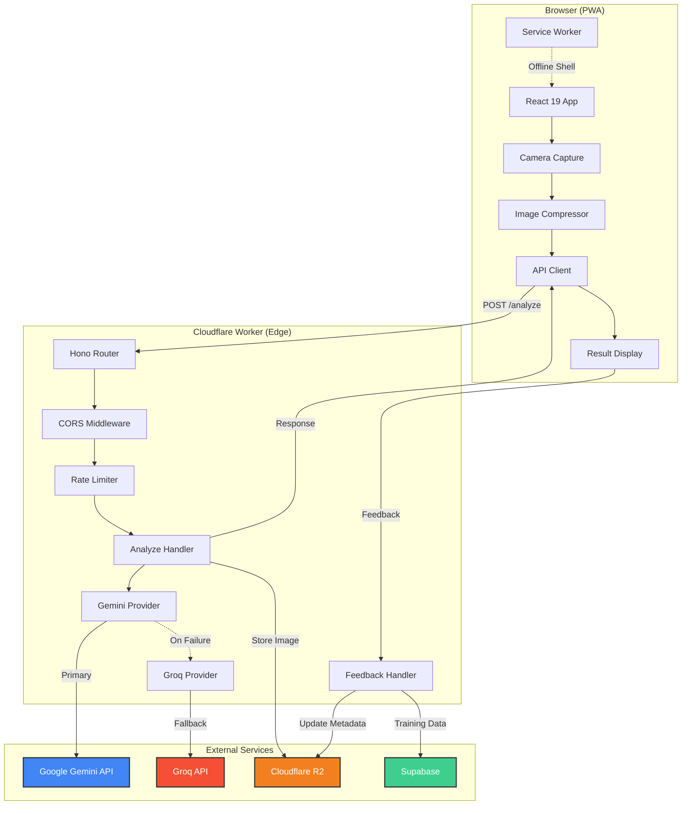
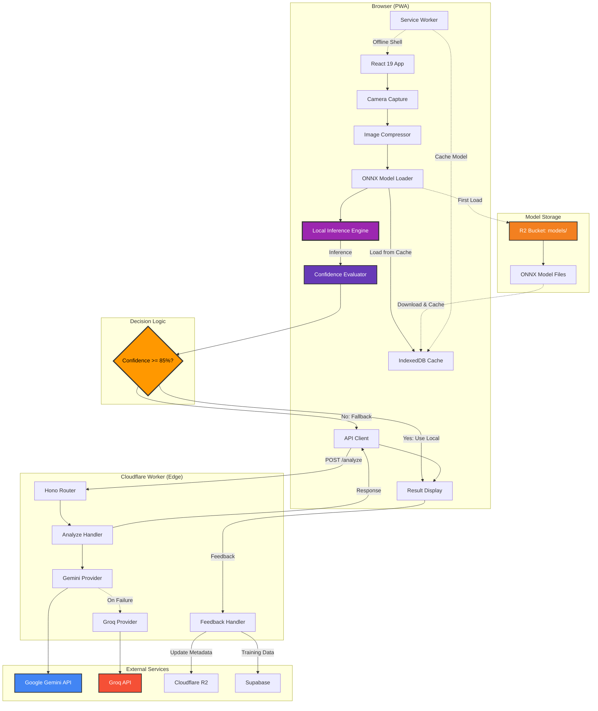
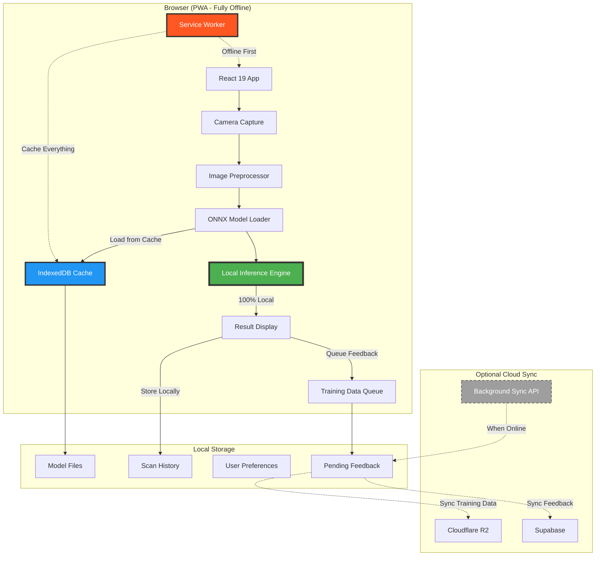

# Afia Oil Tracker — Architecture Documentation

**Generated:** 2026-04-20 | **Scan Level:** Quick | **Mode:** Full Rescan

## Executive Summary

Afia Oil Tracker is a mobile-first Progressive Web App (PWA) that uses AI vision to estimate cooking oil bottle fill levels from photographs. The architecture is designed to evolve through three distinct stages, prioritizing **local-first development** before cloud deployment.

**Current Status:** Stage 1 (LLM Only) deployed to production. Stage 2 (Local Model + LLM Fallback) architecture documented and in development.

## Three-Stage AI Architecture Evolution

The project follows a progressive enhancement strategy, moving from cloud-based AI to fully local inference:

### Stage 1: LLM Only (Current - Cloud-Based)
- **AI Provider:** Gemini 2.5 Flash (primary) + Groq Llama 4 Scout (fallback)
- **Deployment:** Cloudflare Workers + Pages
- **Development:** Local testing with mock services
- **Status:** ✅ Complete and deployed

### Stage 2: Local Model + LLM Fallback (In Progress)
- **Primary:** Local ONNX model running in browser
- **Fallback:** Cloud LLM when local model confidence < 85%
- **Development:** Fully local testing with real ONNX inference
- **Status:** 🚧 Architecture documented, implementation planned

### Stage 3: Local Model Only (Future)
- **AI Provider:** 100% local ONNX model (no cloud dependency)
- **Deployment:** Fully offline-capable PWA
- **Development:** Complete local development and testing
- **Status:** 📋 Planned

---

## Stage 1: LLM Only Architecture (Current)

### Overview

Stage 1 uses cloud-based Large Language Models for image analysis, providing rapid proof-of-concept validation while collecting training data for future local models.

### Architecture Diagram



### Data Flow

1. **Image Capture:** User photographs bottle using rear camera
2. **Compression:** Image resized to 800px max dimension, JPEG quality 0.78
3. **API Request:** Base64-encoded image sent to Worker via POST /analyze
4. **AI Processing:**
   - Worker calls Gemini 2.5 Flash with few-shot visual prompts
   - If Gemini fails, automatic fallback to Groq Llama 4 Scout
   - Response: `{fillPercentage, confidence, imageQualityIssues[], reasoning}`
5. **Storage:** Image and metadata stored in R2 (non-blocking)
6. **Volume Calculation:** Client-side deterministic formulas calculate ml/tbsp/cups
7. **Nutrition Calculation:** Client-side USDA-based calculations for consumed oil
8. **Feedback Loop:** User corrections stored for future model training

### Key Components

#### Frontend (React 19 PWA)

| Component | Purpose | Technology |
|-----------|---------|------------|
| App.tsx | State machine router | React useState |
| CameraCapture | Camera access and photo capture | getUserMedia API |
| ResultDisplay | Fill gauge and volume breakdown | SVG + CSS animations |
| FeedbackPrompt | User accuracy rating | Radix UI Slider |
| Service Worker | Offline shell and caching | Workbox |

#### Worker (Cloudflare Edge)

| Module | Purpose | Technology |
|--------|---------|------------|
| index.ts | HTTP router and middleware | Hono 4.7 |
| analyze.ts | Image analysis orchestration | Gemini/Groq APIs |
| feedback.ts | Feedback validation and storage | R2 + Supabase |
| providers/gemini.ts | Gemini 2.5 Flash integration | Google AI REST API |
| providers/groq.ts | Groq Llama 4 Scout fallback | OpenAI-compatible API |

### Security & Performance

- **Rate Limiting:** 10 requests/min/IP via Cloudflare KV sliding window
- **CORS:** Origin allowlist from environment variable
- **API Latency:** 800-1200ms (Gemini), 600-900ms (Groq)
- **Bundle Size:** ~209KB JS (65KB gzipped), ~9KB CSS

---

## Stage 2: Local Model + LLM Fallback Architecture (In Progress)

### Overview

Stage 2 introduces a lightweight ONNX model that runs directly in the browser, with cloud LLM fallback for low-confidence predictions. This hybrid approach reduces API costs, improves privacy, and enables faster response times while maintaining accuracy.

### Architecture Diagram



### Data Flow

1. **Image Capture:** User photographs bottle using rear camera
2. **Compression:** Image resized and preprocessed for ONNX model
3. **Model Loading:**
   - Check IndexedDB cache for ONNX model
   - If not cached, download from R2 and cache locally
   - Load model into ONNX Runtime Web
4. **Local Inference:**
   - Run image through ONNX model
   - Get prediction: `{fillPercentage, confidence}`
5. **Confidence Evaluation:**
   - **If confidence >= 85%:** Use local prediction (fast path)
   - **If confidence < 85%:** Fallback to cloud LLM (accuracy path)
6. **Cloud Fallback (when needed):**
   - Send image to Worker
   - Worker calls Gemini/Groq as in Stage 1
   - Return high-confidence prediction
7. **Volume & Nutrition:** Client-side calculations (same as Stage 1)
8. **Feedback Loop:** Store both local and cloud predictions for model improvement

### Key Components

#### New Frontend Components

| Component | Purpose | Technology |
|-----------|---------|------------|
| ModelLoader | Download and cache ONNX model | ONNX Runtime Web 1.24.3 |
| LocalInference | Run model inference in browser | WebAssembly + WebGL |
| ConfidenceEvaluator | Decide local vs cloud | Threshold logic |
| ModelUpdater | Check for model updates | Service Worker + IndexedDB |

#### Enhanced Worker Components

| Module | Purpose | Changes from Stage 1 |
|--------|---------|---------------------|
| analyze.ts | Hybrid analysis orchestration | Accept `localConfidence` parameter |
| feedback.ts | Enhanced feedback validation | Store both local and cloud predictions |
| models/ | Model version management | Track active model version in R2 |

### Confidence Threshold Strategy

```typescript
interface InferenceResult {
  fillPercentage: number;
  confidence: number;
  source: 'local' | 'cloud';
  latencyMs: number;
}

function shouldUseLLMFallback(localResult: InferenceResult): boolean {
  return localResult.confidence < 0.85; // 85% threshold
}
```

### Performance Improvements

| Metric | Stage 1 (LLM Only) | Stage 2 (Hybrid) | Improvement |
|--------|-------------------|------------------|-------------|
| Average Latency | 800-1200ms | 200-400ms (local) | 3-4x faster |
| API Calls | 100% | ~20-30% | 70-80% reduction |
| Offline Capability | Shell only | Full inference | Complete |
| Privacy | Cloud processing | Local processing | Enhanced |

### Model Specifications

- **Format:** ONNX (Open Neural Network Exchange)
- **Input:** 224x224 RGB image (normalized)
- **Output:** Fill percentage (0-100) + confidence score
- **Size:** ~5-10MB (quantized INT8)
- **Inference Time:** 150-300ms on mobile devices
- **Accuracy Target:** 90%+ on validation set

---

## Stage 3: Local Model Only Architecture (Future)

### Overview

Stage 3 eliminates cloud dependency entirely, running 100% locally with an improved ONNX model. This provides maximum privacy, zero API costs, and full offline functionality.

### Architecture Diagram



### Data Flow

1. **Image Capture:** User photographs bottle using rear camera
2. **Preprocessing:** Image optimized for local model (224x224, normalized)
3. **Model Loading:**
   - Load ONNX model from IndexedDB cache
   - Model is pre-cached during PWA installation
4. **Local Inference:**
   - Run image through improved ONNX model
   - Get high-confidence prediction: `{fillPercentage, confidence}`
   - **No cloud fallback** - model is accurate enough standalone
5. **Volume & Nutrition:** Client-side calculations (same as Stage 1 & 2)
6. **Local Storage:**
   - Store scan results in IndexedDB
   - Queue feedback for optional background sync
7. **Optional Cloud Sync:**
   - When online, sync training data to R2 (background)
   - Sync feedback to Supabase (background)
   - **App works fully offline** - sync is optional

### Key Components

#### Enhanced Frontend Components

| Component | Purpose | Technology |
|-----------|---------|------------|
| ImprovedModelLoader | Load optimized ONNX model | ONNX Runtime Web + WebAssembly |
| OfflineInference | 100% local inference | WebGL acceleration |
| LocalStorageManager | Manage scan history | IndexedDB |
| BackgroundSyncManager | Optional cloud sync | Background Sync API |
| ModelUpdateChecker | Check for model updates | Service Worker |

#### Removed Components

- API Client (no cloud calls during inference)
- Confidence Evaluator (no fallback needed)
- Cloud LLM providers (Gemini/Groq)

### Performance Characteristics

| Metric | Stage 2 (Hybrid) | Stage 3 (Local Only) | Improvement |
|--------|------------------|---------------------|-------------|
| Average Latency | 200-400ms (local) | 150-250ms | 1.5x faster |
| API Calls | 20-30% | 0% | 100% elimination |
| Offline Capability | Full inference | Complete app | Full feature parity |
| Privacy | Local processing | 100% local | Maximum |
| API Costs | $0.20-0.30/1000 scans | $0 | 100% savings |

### Model Improvements

- **Format:** ONNX (quantized INT8)
- **Input:** 224x224 RGB image
- **Output:** Fill percentage (0-100) + confidence score
- **Size:** ~8-12MB (optimized for mobile)
- **Inference Time:** 150-250ms on mobile devices
- **Accuracy Target:** 95%+ on validation set
- **Training Data:** 10,000+ labeled images from Stage 1 & 2

### Offline-First Features

1. **Complete Functionality:** All features work without internet
2. **Local History:** Scan history stored in IndexedDB
3. **Background Sync:** Optional sync when online (non-blocking)
4. **Model Updates:** Check for updates when online, cache locally
5. **Progressive Enhancement:** Graceful degradation if sync fails

---

## Multi-Tier Architecture Pattern

All three stages follow a consistent multi-tier pattern:

### Presentation Layer
- **Technology:** React 19 with TypeScript
- **Pattern:** Finite State Machine (FSM)
- **States:** `qr-landing` → `camera-capture` → `analyzing` → `result-display` → `feedback-prompt`
- **Rendering:** Client-side rendering (CSR)

### Business Logic Layer
- **Location:** Browser (client-side)
- **Modules:**
  - `volumeCalculator.ts` - Cylinder/frustum geometry formulas
  - `nutritionCalculator.ts` - USDA-based nutrition facts
  - `feedbackValidator.ts` - 4-flag validation system
- **Pattern:** Pure functions, deterministic calculations

### AI Layer (Evolves Across Stages)
- **Stage 1:** Cloud LLM (Gemini/Groq)
- **Stage 2:** Local ONNX + Cloud LLM fallback
- **Stage 3:** Local ONNX only

### API Layer (Stage 1 & 2 Only)
- **Technology:** Cloudflare Workers + Hono
- **Pattern:** Edge compute, serverless
- **Endpoints:** POST /analyze, POST /feedback, GET /health

### Storage Layer
- **Stage 1:** Cloudflare R2 + Supabase
- **Stage 2:** IndexedDB (cache) + R2 + Supabase
- **Stage 3:** IndexedDB (primary) + optional R2/Supabase sync

---

## Component Hierarchy

### Frontend Component Tree

```
App.tsx (FSM Router)
├── IosWarning (iOS in-app browser detection)
├── UnknownBottle (invalid SKU fallback)
├── QrLanding (IDLE state)
│   └── PrivacyNotice (first-visit consent)
├── CameraCapture (CAMERA_ACTIVE state)
│   └── useCamera hook (getUserMedia + canvas)
├── [Photo Preview] (PHOTO_CAPTURED state)
├── ApiStatus (API_PENDING / API_ERROR state)
└── ResultDisplay (API_SUCCESS / API_LOW_CONFIDENCE state)
    ├── FillGauge (SVG bottle visualization)
    ├── Volume Breakdown (ml/tbsp/cups)
    ├── Nutrition Facts (calories, fat)
    └── FeedbackPrompt (accuracy rating + correction)
```

### Worker Module Structure (Stage 1 & 2)

```
worker/src/
├── index.ts (Hono router + middleware)
├── analyze.ts (POST /analyze handler)
├── feedback.ts (POST /feedback handler)
├── bottleRegistry.ts (SKU → geometry mapping)
├── types.ts (TypeScript interfaces)
├── providers/
│   ├── gemini.ts (Gemini 2.5 Flash)
│   └── groq.ts (Groq Llama 4 Scout)
├── validation/
│   └── feedbackValidator.ts (4-flag validation)
└── storage/
    └── r2Client.ts (R2 image storage)
```

---

## Data Models

### Core Interfaces

```typescript
// Bottle Geometry
interface Bottle {
  sku: string;
  brand: string;
  name: string;
  volumeMl: number;
  geometry: 'cylinder' | 'frustum';
  oilType: OilType;
  dimensions?: {
    topDiameterMm?: number;
    bottomDiameterMm?: number;
    heightMm?: number;
  };
}

// Analysis Result
interface AnalysisResult {
  scanId: string;
  fillPercentage: number;
  confidence: number;
  aiProvider: 'gemini' | 'groq' | 'local-onnx';
  latencyMs: number;
  imageQualityIssues?: string[];
  reasoning?: string;
}

// Feedback Validation
interface FeedbackValidation {
  flags: {
    too_fast: boolean;
    boundary_value: boolean;
    contradictory: boolean;
    extreme_delta: boolean;
  };
  confidenceWeight: number; // 0.1 to 1.0
  trainingEligible: boolean;
}
```

---

## Security Architecture

### Stage 1 & 2 Security

| Layer | Mechanism |
|-------|-----------|
| CORS | Origin allowlist (`ALLOWED_ORIGINS` env var) |
| Rate Limiting | 10 req/min/IP via Cloudflare KV sliding window |
| Input Validation | SKU validation, image size cap (4MB) |
| Secrets | API keys in Cloudflare secrets (not in code) |
| HTTP Headers | CSP, X-Frame-Options: DENY, X-Content-Type-Options: nosniff |
| Permissions-Policy | camera=self, microphone=(), geolocation=() |

### Stage 3 Security Enhancements

- **No API Keys:** Zero cloud API dependencies
- **Local Processing:** All data stays on device
- **Optional Sync:** User controls when/if data syncs
- **Encrypted Storage:** IndexedDB encryption for sensitive data

---

## Testing Strategy

### Unit Tests (All Stages)

| Module | Tests | Coverage |
|--------|-------|----------|
| volumeCalculator | 16 | Cylinder, frustum, unit conversions |
| nutritionCalculator | 7 | Unknown oil, zero volume, scaling |
| feedbackValidator | 11 | All 4 flags, weight decay |

### Integration Tests

- **Stage 1:** Mock Gemini/Groq responses
- **Stage 2:** Mock ONNX inference + LLM fallback
- **Stage 3:** Mock ONNX inference only

### E2E Tests (Playwright)

- Camera capture flow
- Scan and result display
- Feedback submission
- Offline functionality (Stage 2 & 3)

---

## Deployment Architecture

### Stage 1 & 2 Deployment

```
GitHub (main branch)
  │
  ├── GitHub Actions: deploy.yml
  │   ├── Job: test → npm test + worker tsc --noEmit
  │   ├── Job: build → npm run build → artifact
  │   ├── Job: deploy-worker → wrangler deploy (main only)
  │   └── Job: deploy-pages → wrangler pages deploy (main only)
  │
  ▼
Cloudflare
  ├── Pages: afia-oil-tracker.pages.dev (frontend PWA)
  └── Workers: afia-worker.savola.workers.dev (API)
      ├── KV: RATE_LIMIT_KV
      ├── R2: afia-training-data
      └── Secrets: GEMINI_API_KEY(s), GROQ_API_KEY
```

### Stage 3 Deployment

```
GitHub (main branch)
  │
  ├── GitHub Actions: deploy.yml
  │   ├── Job: test → npm test
  │   ├── Job: build → npm run build (includes ONNX model)
  │   └── Job: deploy-pages → wrangler pages deploy
  │
  ▼
Cloudflare Pages
  ├── Static Assets: HTML, CSS, JS
  ├── ONNX Model: models/oil-tracker-v3.onnx
  └── Service Worker: Offline-first caching
```

---

## Migration Path

### Stage 1 → Stage 2 Migration

1. **Train ONNX Model:**
   - Use collected data from Stage 1 (R2 + Supabase)
   - Train model to 90%+ accuracy
   - Export to ONNX format, quantize to INT8

2. **Implement Local Inference:**
   - Add ONNX Runtime Web dependency
   - Create ModelLoader and LocalInference components
   - Implement confidence threshold logic

3. **Test Hybrid Approach:**
   - Test local inference on various devices
   - Validate fallback mechanism
   - Measure performance improvements

4. **Deploy Gradually:**
   - Feature flag for Stage 2 (A/B test)
   - Monitor confidence distribution
   - Adjust threshold based on real-world data

### Stage 2 → Stage 3 Migration

1. **Improve Model Accuracy:**
   - Collect more training data from Stage 2
   - Retrain model to 95%+ accuracy
   - Optimize for mobile performance

2. **Remove Cloud Dependencies:**
   - Remove API client for inference
   - Implement full offline functionality
   - Add background sync for optional cloud sync

3. **Test Offline Functionality:**
   - Test complete offline flow
   - Validate background sync
   - Ensure graceful degradation

4. **Deploy as Default:**
   - Make Stage 3 the default experience
   - Keep Stage 2 as fallback (feature flag)
   - Monitor user feedback and accuracy

---

## Performance Metrics

### Bundle Sizes

| Stage | JavaScript | CSS | ONNX Model | Total First Load |
|-------|-----------|-----|------------|------------------|
| Stage 1 | ~209KB (65KB gzip) | ~9KB | - | <100KB gzipped |
| Stage 2 | ~220KB (70KB gzip) | ~9KB | ~8MB (cached) | <100KB gzipped + 8MB model |
| Stage 3 | ~200KB (65KB gzip) | ~9KB | ~10MB (cached) | <100KB gzipped + 10MB model |

### API Latency

| Stage | Average Latency | P95 Latency | API Calls |
|-------|----------------|-------------|-----------|
| Stage 1 | 800-1200ms | 1500ms | 100% |
| Stage 2 | 200-400ms (local) | 1200ms (fallback) | 20-30% |
| Stage 3 | 150-250ms | 300ms | 0% |

---

## Known Limitations

### Stage 1 Limitations
1. **API Dependency:** Requires internet connection
2. **Latency:** 800-1200ms average response time
3. **Cost:** ~$0.50-1.00 per 1000 scans
4. **Privacy:** Images processed in cloud

### Stage 2 Limitations
1. **Model Size:** 8MB initial download
2. **Device Compatibility:** Requires WebAssembly + WebGL
3. **Accuracy:** Local model may be less accurate than LLM
4. **Fallback Latency:** Still 800-1200ms when confidence is low

### Stage 3 Limitations
1. **Model Size:** 10MB initial download
2. **Device Compatibility:** Requires modern browser with WebAssembly
3. **Training Data Sync:** Requires periodic online connection for model updates

---

## Next Steps

### Immediate (Stage 2 Implementation)
1. ✅ Document three-stage architecture
2. 🚧 Train ONNX model from collected data
3. 🚧 Implement local inference pipeline
4. 🚧 Add confidence threshold logic
5. 🚧 Test hybrid approach locally

### Short-term (Stage 2 Deployment)
1. Deploy Stage 2 to production with feature flag
2. Monitor confidence distribution and accuracy
3. Collect feedback on local inference performance
4. Optimize model for mobile devices
5. Adjust confidence threshold based on real-world data

### Long-term (Stage 3 Planning)
1. Improve local model accuracy to 95%+
2. Remove cloud LLM dependency
3. Implement full offline functionality
4. Add background sync for optional cloud sync
5. Deploy Stage 3 as default experience

---

**For detailed component documentation, see [Component Inventory](./component-inventory.md).**

**For API contracts (Stage 1 & 2), see [API Contracts](./api-contracts.md).**

**For data models, see [Data Models](./data-models.md).**
