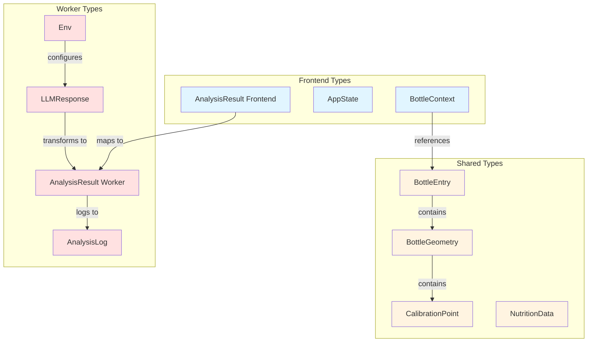

# Data Models

**Last Updated**: 2026-04-20  
**Status**: ✅ Complete

## Overview

This document describes the TypeScript interfaces and data models used throughout the Oil Tracker application. The system uses a strongly-typed architecture with shared types between frontend and worker.

---

## Table of Contents

1. [Core Analysis Types](#core-analysis-types)
2. [Application State](#application-state)
3. [Bottle Registry](#bottle-registry)
4. [Worker Environment](#worker-environment)
5. [Nutrition Data](#nutrition-data)
6. [Type Relationships](#type-relationships)

---

## Core Analysis Types

### AnalysisResult (Frontend)

**Location**: `src/state/appState.ts`

The primary result object returned from the analysis API and stored in application state.

```typescript
interface AnalysisResult {
  scanId: string;
  fillPercentage: number;
  remainingMl: number;
  confidence: "high" | "medium" | "low";
  aiProvider: "gemini" | "groq" | "openrouter" | "mistral" | 
              "local-cnn" | "local-tfjs" | "mock-api" | "queued";
  latencyMs: number;
  imageQualityIssues?: string[];
  isUnsupportedSku?: boolean;
  red_line_y_normalized?: number;
  
  // Stage 2: Local model metadata
  localModelResult?: {
    fillPercentage: number;
    confidence: number;
    modelVersion: string;
    inferenceTimeMs: number;
  };
  llmFallbackUsed?: boolean;
  
  // Stage 3: Offline mode indicators
  offlineMode?: boolean;
  queuedForSync?: boolean;
}
```

**Key Fields**:
- `scanId`: Unique identifier for this analysis
- `fillPercentage`: 0-100 representing oil level
- `remainingMl`: Calculated remaining volume
- `confidence`: Model confidence level
- `aiProvider`: Which AI service processed the image
- `localModelResult`: Present when local ONNX model was used (Stage 2)
- `llmFallbackUsed`: True if local model failed and LLM was used as backup
- `offlineMode`: True if analysis was done offline with low confidence
- `queuedForSync`: True if scan was queued for background sync

### AnalysisResult (Worker API)

**Location**: `src/types/analysis.ts`

The structured response from the worker API endpoint.

```typescript
interface AnalysisResult {
  analysis: {
    estimated_volume_ml: number;
    confidence_score: number;
    meniscus_detected: boolean;
  };
  ui_mapping: {
    red_line_y_normalized: number;  // 0-1000 scale
    bottle_top_y_px: number;
    bottle_bottom_y_px: number;
  };
  logic_flags: {
    below_55ml_threshold: boolean;
    lighting_quality: 'good' | 'poor';
    guidance_needed: string | null;
  };
}
```

**Key Fields**:
- `estimated_volume_ml`: LLM's volume estimate
- `confidence_score`: 0-1 confidence value
- `meniscus_detected`: Whether oil surface was clearly visible
- `red_line_y_normalized`: Pixel position for UI overlay (0=bottom, 1000=top)
- `below_55ml_threshold`: Triggers "time to refill" warning
- `guidance_needed`: User guidance message if image quality is poor

### AnalysisLog

**Location**: `src/types/analysis.ts`

Training data record stored in Supabase for model improvement.

```typescript
interface AnalysisLog {
  id?: string;
  created_at?: string;
  image_url: string;
  primary_provider: string;
  local_result_ml?: number;
  llm_result_ml?: number;
  llm_raw_response?: any;
  status: 'success' | 'failed' | 'mismatch' | 'flagged';
  error_message?: string;
}
```

**Status Values**:
- `success`: Both local and LLM agreed (within threshold)
- `failed`: Analysis failed completely
- `mismatch`: Local and LLM results diverged significantly
- `flagged`: User reported incorrect result

---

## Application State

### AppState

**Location**: `src/state/appState.ts`

State machine representing the application's current screen/mode.

```typescript
type AppState =
  | "IDLE"                  // Home screen, ready to scan
  | "CAMERA_ACTIVE"         // Camera viewfinder open
  | "API_PENDING"           // Analysis in progress
  | "FILL_CONFIRM"          // Showing result with red line overlay
  | "API_SUCCESS"           // Success state (brief)
  | "API_LOW_CONFIDENCE"    // Low confidence warning
  | "API_ERROR";            // Error state
```

**State Transitions**:
```
IDLE → CAMERA_ACTIVE → API_PENDING → FILL_CONFIRM → IDLE
                              ↓
                        API_ERROR → IDLE
                              ↓
                    API_LOW_CONFIDENCE → IDLE
```

### BottleContext

**Location**: `src/state/appState.ts`

Metadata about the currently selected bottle.

```typescript
interface BottleContext {
  sku: string;              // e.g., "afia-corn-1.5l"
  name: string;             // e.g., "Afia Pure Corn Oil 1.5L"
  oilType: string;          // e.g., "corn"
  totalVolumeMl: number;    // e.g., 1500
}
```

---

## Bottle Registry

### BottleEntry

**Location**: `shared/bottleRegistry.ts`

Complete bottle specification including geometry and calibration data.

```typescript
interface BottleEntry {
  sku: string;
  name: string;
  oilType: string;
  totalVolumeMl: number;
  geometry: BottleGeometry;
  imageUrl?: string;
  promptAnchors?: string;
  frameTopPct?: number;     // Default: 0.05
  frameBottomPct?: number;  // Default: 0.95
}
```

**Key Fields**:
- `geometry`: Physical shape and calibration points
- `promptAnchors`: Visual landmarks for LLM prompt (e.g., "Oil at label center: ~38%")
- `frameTopPct/frameBottomPct`: Expected bottle position in camera frame

### BottleGeometry

**Location**: `shared/bottleRegistry.ts`

Physical bottle shape specification.

```typescript
interface BottleGeometry {
  shape: "cylinder" | "frustum" | "calibrated";
  heightMm?: number;
  diameterMm?: number;
  topDiameterMm?: number;
  bottomDiameterMm?: number;
  calibrationPoints?: CalibrationPoint[];
}
```

**Shape Types**:
- `cylinder`: Simple cylindrical bottle (uses diameter + height)
- `frustum`: Tapered bottle (uses top/bottom diameters + height)
- `calibrated`: Irregular shape with manual calibration points (most accurate)

### CalibrationPoint

**Location**: `shared/bottleRegistry.ts`

Manual calibration data point mapping fill height to volume.

```typescript
interface CalibrationPoint {
  fillHeightPct: number;    // 0-100: % of bottle height
  remainingMl: number;      // Volume at this fill level
}
```

**Example** (Afia 1.5L bottle):
```typescript
calibrationPoints: [
  { fillHeightPct: 0,  remainingMl: 0    },  // Empty
  { fillHeightPct: 3,  remainingMl: 55   },  // Refill threshold
  { fillHeightPct: 38, remainingMl: 660  },  // Label center
  { fillHeightPct: 78, remainingMl: 1320 },  // Shoulder
  { fillHeightPct: 97, remainingMl: 1500 },  // Full
]
```

### Active SKU Constants

**Location**: `shared/bottleRegistry.ts`

```typescript
const ACTIVE_SKU = "afia-corn-1.5l";
const bottleRegistry: BottleEntry[] = [/* 2 bottles */];
const activeBottleRegistry: BottleEntry[] = [...bottleRegistry];
```

**Current Restriction**: Only `afia-corn-1.5l` is fully supported. The 2.5L entry is a placeholder for future expansion.

---

## Worker Environment

### Env

**Location**: `worker/src/types.ts`

Cloudflare Worker environment bindings and secrets.

```typescript
interface Env {
  // Supabase
  SUPABASE_URL: string;
  SUPABASE_ANON_KEY: string;
  SUPABASE_SERVICE_ROLE_KEY?: string;
  
  // Rate limiting
  RATE_LIMIT_KV: KVNamespace;
  
  // LLM API keys
  GEMINI_API_KEY: string;
  GEMINI_API_KEY2?: string;
  GEMINI_API_KEY3?: string;
  GEMINI_API_KEY4?: string;
  GROQ_API_KEY?: string;
  OPENROUTER_API_KEY?: string;
  MISTRAL_API_KEY?: string;
  
  // Admin
  ADMIN_PASSWORD?: string;
  
  // Monitoring
  BETTERSTACK_TOKEN?: string;
  SLACK_WEBHOOK_URL?: string;
  
  // Configuration
  ALLOWED_ORIGINS: string;
  DEBUG_REASONING?: string;
  ENABLE_MOCK_LLM?: string;
}
```

**Key Bindings**:
- `RATE_LIMIT_KV`: Cloudflare KV namespace for rate limiting
- Multiple `GEMINI_API_KEY*`: Key rotation for high availability
- `ENABLE_MOCK_LLM`: Set to "true" for local development without API keys

### LLMResponse

**Location**: `worker/src/types.ts`

Structured response from LLM vision models.

```typescript
interface LLMResponse {
  brand: "Afia" | "unknown";
  fillPercentage: number;
  confidence: "high" | "medium" | "low";
  imageQualityIssues?: string[];
  reasoning?: string;
  
  // UI mapping
  red_line_y_normalized?: number;
  bottle_top_y_px?: number;
  bottle_bottom_y_px?: number;
  below_55ml_threshold?: boolean;
  guidanceNeeded?: string | null;
}
```

**Key Fields**:
- `brand`: Brand detection (currently only "Afia" supported)
- `fillPercentage`: 0-100 oil level estimate
- `reasoning`: LLM's explanation (only included if `DEBUG_REASONING=true`)
- `red_line_y_normalized`: Pixel position for UI overlay

---

## Nutrition Data

### NutritionData

**Location**: `src/data/oilNutrition.ts`

Nutritional information for different oil types.

```typescript
interface NutritionData {
  oilType: string;
  name: string;
  fdcId: number;            // USDA FoodData Central ID
  densityGPerMl: number;
  per100g: {
    calories: number;
    totalFatG: number;
    saturatedFatG: number;
  };
}
```

**Example**:
```typescript
{
  oilType: "corn",
  name: "Corn Oil",
  fdcId: 172862,
  densityGPerMl: 0.92,
  per100g: {
    calories: 884,
    totalFatG: 100,
    saturatedFatG: 10.3,
  }
}
```

**Supported Oil Types**:
- `extra_virgin_olive`
- `pure_olive`
- `sunflower`

---

## Type Relationships

### Data Flow Diagram



### Type Usage by Stage

| Type | Stage 1 (LLM Only) | Stage 2 (Local + LLM) | Stage 3 (Local Only) |
|------|-------------------|----------------------|---------------------|
| `AnalysisResult.aiProvider` | ✅ gemini/groq | ✅ local-cnn/local-tfjs | ✅ local-cnn |
| `AnalysisResult.localModelResult` | ❌ undefined | ✅ populated | ✅ populated |
| `AnalysisResult.llmFallbackUsed` | ❌ undefined | ✅ true/false | ❌ false |
| `AnalysisResult.offlineMode` | ❌ false | ⚠️ possible | ✅ always true |
| `AnalysisResult.queuedForSync` | ❌ false | ⚠️ possible | ✅ possible |
| `LLMResponse` | ✅ required | ⚠️ fallback only | ❌ not used |

### Validation Rules

**BottleEntry Validation**:
- `sku` must be unique across registry
- `totalVolumeMl` must match highest `calibrationPoint.remainingMl`
- `calibrationPoints` must be sorted ascending by `fillHeightPct`
- `frameTopPct` must be < `frameBottomPct`

**AnalysisResult Validation**:
- `fillPercentage` must be 0-100
- `remainingMl` must be 0-`totalVolumeMl`
- `confidence` must be "high", "medium", or "low"
- If `localModelResult` exists, `aiProvider` must be "local-cnn" or "local-tfjs"

**CalibrationPoint Validation**:
- First point must be `{ fillHeightPct: 0, remainingMl: 0 }`
- Last point must be `{ fillHeightPct: ~97-100, remainingMl: totalVolumeMl }`
- Points must be monotonically increasing

---

## Migration Notes

### Stage 1 → Stage 2 Migration

When adding local model support:

1. Add `localModelResult` to `AnalysisResult`
2. Add `llmFallbackUsed` flag
3. Update `aiProvider` to include "local-cnn" and "local-tfjs"
4. Ensure backward compatibility: old scans without `localModelResult` still work

### Stage 2 → Stage 3 Migration

When removing LLM dependency:

1. Add `offlineMode` and `queuedForSync` flags
2. Make `LLMResponse` optional in worker
3. Update `aiProvider` to default to "local-cnn"
4. Add sync queue for low-confidence offline scans

---

## Related Documentation

- [Architecture](./architecture.md) - System architecture and data flow
- [API Contracts](./api-contracts.md) - REST API request/response schemas
- [Component Inventory](./component-inventory.md) - React components using these types

---

**Generated by**: BMad Document Project Workflow  
**Workflow Version**: 1.2.0  
**Scan Level**: Quick Scan (pattern-based)
